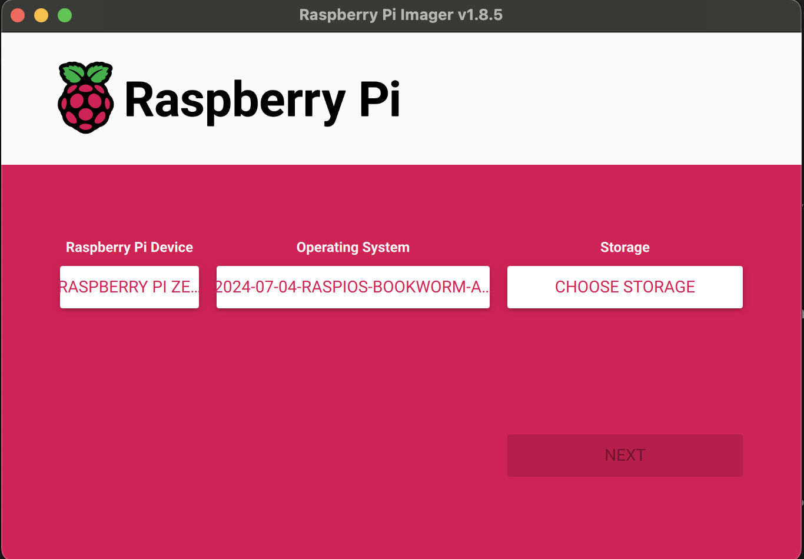
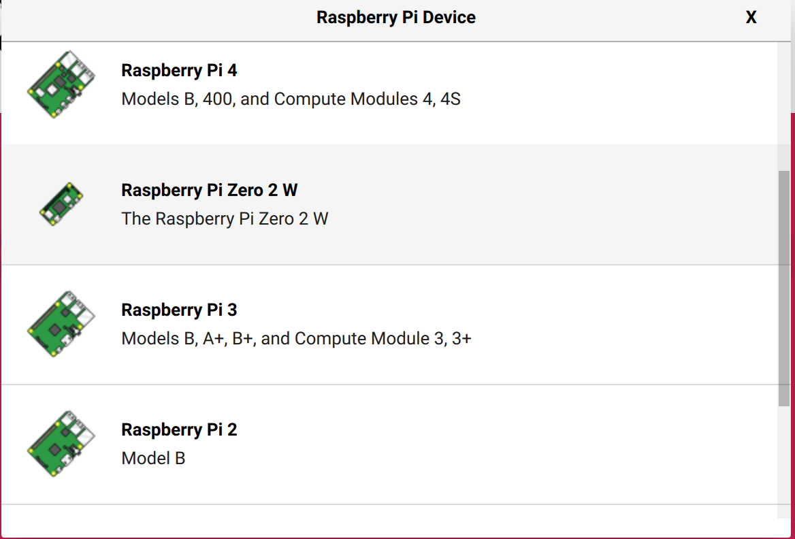
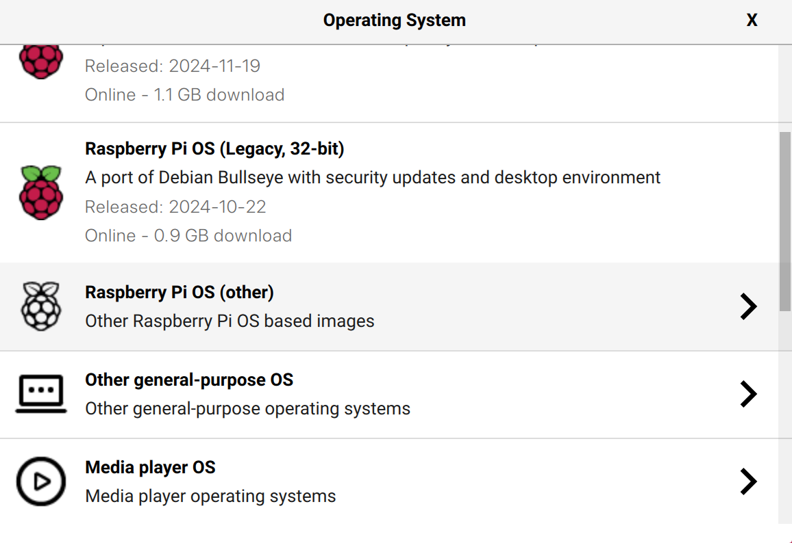
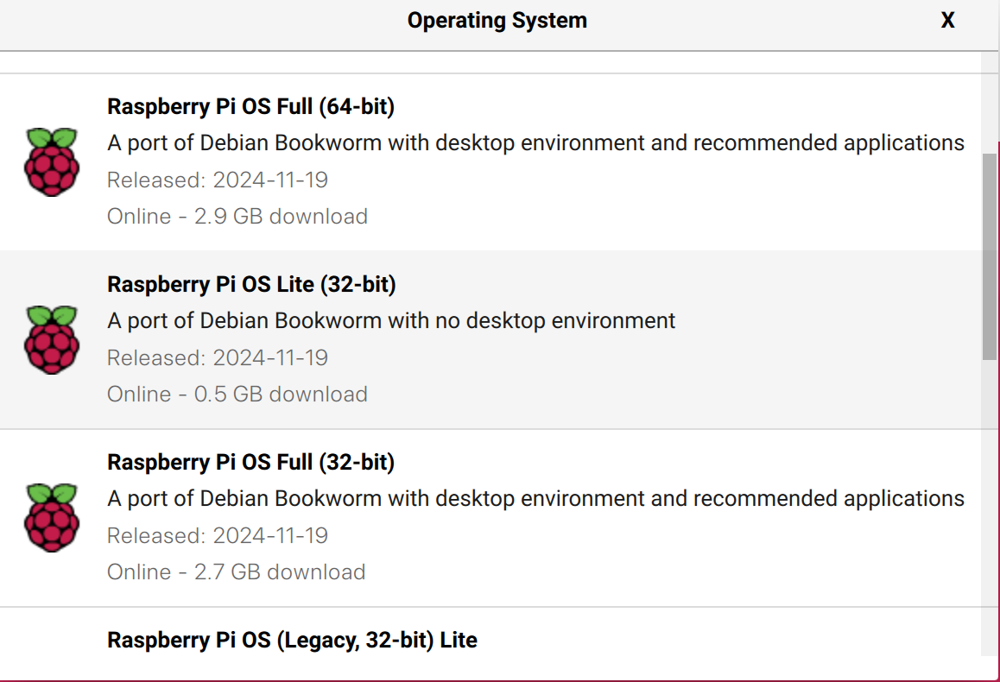
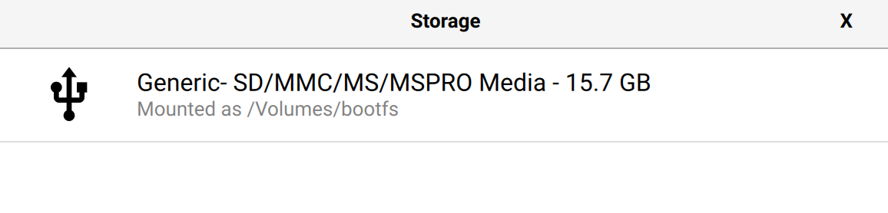
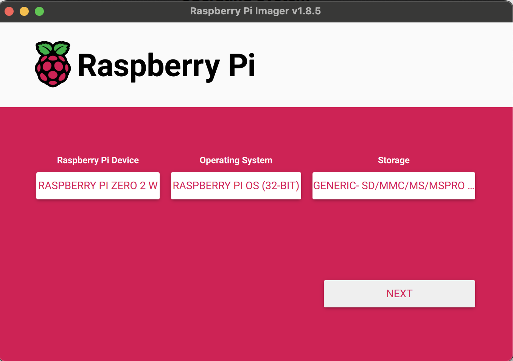
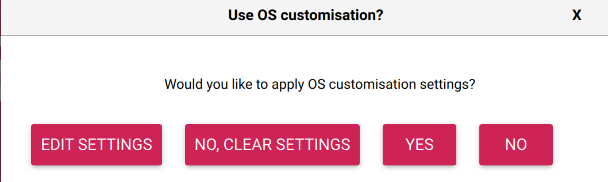
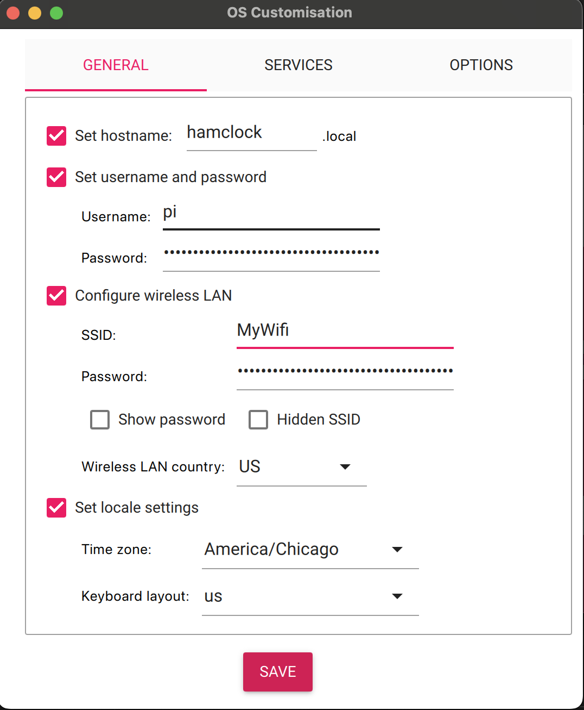
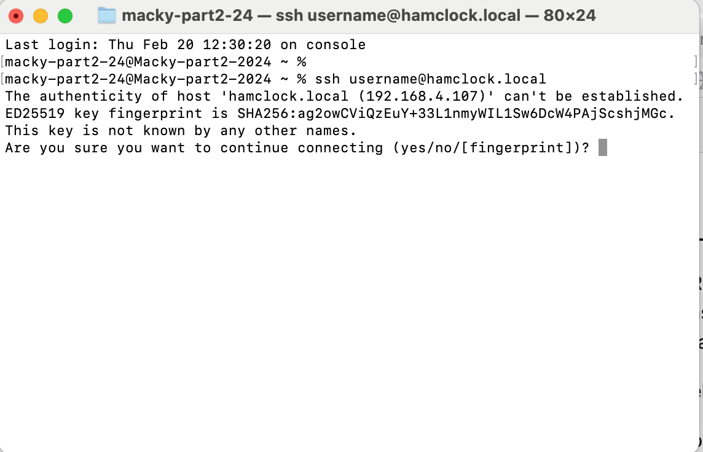
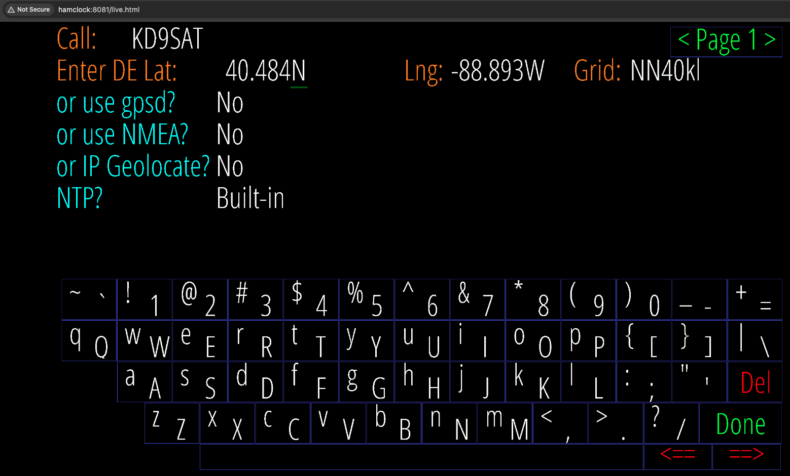

# HamClock

### [HamClock](https://www.clearskyinstitute.com/ham/HamClock/) is a kiosk-style application that provides real time space weather, radio propagation models, operating events and other information particularly useful to the radio amateur. HamClock was introduced in my October 2017 QST article and continues to be maintained and expanded.


### These instructions were generated for HamClock Installation on Raspberry Pi Zero 2 W. that said, this would likely work on other versions of the Pi but has not been tested to ensure the process is the same.

### To do this build you'll need the following:
- Raspberry Pi Zero 2W
- Power supply that can provide at least 2 amps
- Micro USB cable for power
- Micro SD card
- Some way to write the micro SD card

# Prepare the Raspberry Pi

## Let's load the micro SD card with Raspberry Pi Operating System using the Raspberry Pi Imager:

### Before getting started, You'll need to have some tools on your machine.

- You'll need to download the [Raspberry Pi Imager](https://www.raspberrypi.com/software/) for the operating system your running.
- You'll need the ability to telnet / ssh into the raspberry pi for this installation. This allows you to interact with the Raspberry PI from your workstation:
  - If you have a Mac you have a telnet client built in. (Go > Applications > Utilities > Terminal)
  - If you have a PC then you'll need to download something like [Putty](https://www.putty.org/)

## Let's get the operating system installed:
- Open the Pi imager:



  - Device: Select Raspberry Pi Zero 2 W.

  
    
    - Choose Operating System Raspberry Pi OS (other):
    

    
    - OS: Choose Raspberry Pi OS (32-bit), Choose Raspberry Pi OS Lite (32 bit)


    
    - You'll need to insert the SD card in your laptop. 
    - Storage: Select the SD card and click Next. Note, what you have may look slightly different. 
    


- Now imager should look similar to this:



    - Click on next
    - To set the advanced settings, click on edit settings:



    - Customization:


    Now lets get the settings configured to allow your Pi to connect to your wifi and some other details:

 - General Tab:
    - Set hostname to your liking (e.g., hamclock).
    - Configure OS username and password. I'd leave the username as pi but create a new password of your liking.
    - Set WiFi SSID and password for your network.
    - Set locale settings to US, Chicago.
    
- Services Tab:
    - Enable SSH and use password authentication.
    - Save and confirm Apply OS customizations.
    - Burn the image to the SD card.


 
 - Insert the SD card into the Raspberry Pi and plug into a power source. The initial bootup takes a little longer so be patient. You'll notice the green power light will flash a bit. When it settles down you should be good to go. Please note, the SD card only goes one way so don't force it or you can break things.

 - Now its time to open your telnet client

   - You'll need the ability to telnet / ssh into the raspberry pi for this installation. This allows you to interact with the Raspberry PI from your workstation:
   - If you have a Mac you have a telnet client built in. (Applications > Utilities > Terminal)
   - If you have a PC then you'll need to download something like [Putty](https://www.putty.org/)

 - Connect via SSH:
    - Use the hostname (hamclock.local) or the assigned IP address.
    ```
    ssh username@hamclock.local
    ```
 - When connecting to a host for the first time with SSH it will ask you to confirm some items. Choose yes by typing yes



## Update the System
- Run the following commands:
  ```
  sudo apt-get update
  sudo apt-get upgrade -y
  ```

## Install HamClock
Follow the official installation instructions from HamClock’s website.

- Download and run the installer from your terminal (ssh):
  ```
  cd
  curl -O https://www.clearskyinstitute.com/ham/HamClock/install-hc-rpi
  chmod u+x install-hc-rpi
  ./install-hc-rpi
  ```
- Answer installation prompts:
  - Web access only (no hardware display)? → y
  - Select HamClock size:
    1. 800x480
    2. 1600x960
    3. 2400x1440
    4. 3200x1920

- Choose Option 3 (2400x1440)
- start HamClock automatically each time Pi is booted? [y/n] - type y
  - (This adds a crontab entry.)
- Build process takes ~8 minutes.

Reboot the system:
```
sudo reboot now
```

4. Access HamClock
- On another machine, open a web browser and go to:
http://[ip-address-or-hostname]:8081/live.html

Example:
http://hamclock:8081/live.html

- The HamClock configuration page will open.
Enter Callsign and Location info.
Use LatLong.net to find coordinates (e.g., 40.477, -88.993).


🎉 That’s it! HamClock is now installed and accessible on your Raspberry Pi!