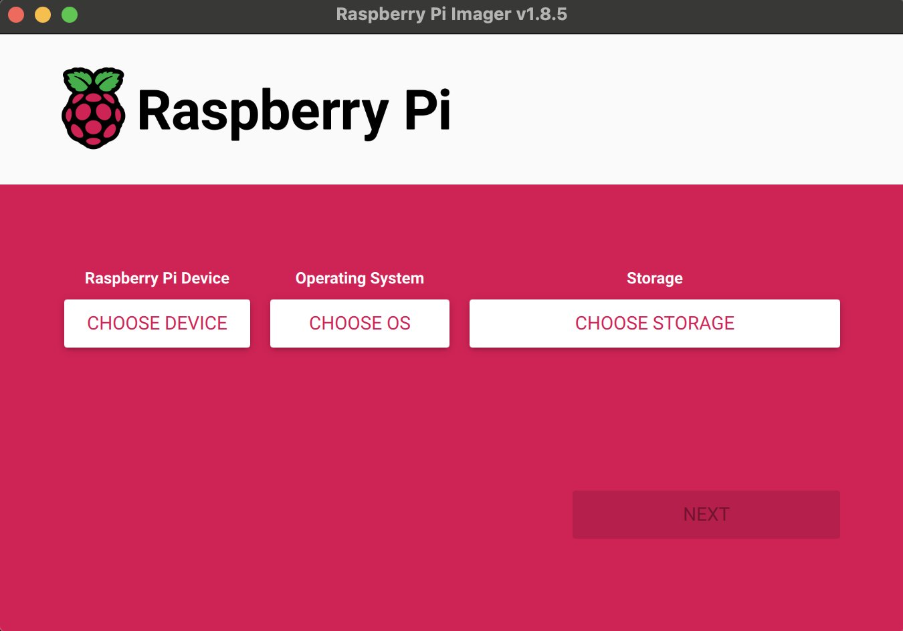

# HamClock

### [HamClock](https://www.clearskyinstitute.com/ham/HamClock/) is a kiosk-style application that provides real time space weather, radio propagation models, operating events and other information particularly useful to the radio amateur. HamClock was introduced in my October 2017 QST article and continues to be maintained and expanded.


### These instructions were generated for HamClock Installation on Raspberry Pi Zero 2 W. that said, this would likely work on other versions of the Pi but has not been tested to ensure the process is the same.

# Prepare the Raspberry Pi

## Let's load the micro SD card with Raspberry Pi Operating System using the Raspberry Pi Imager:

### Before getting started, You'll need to have some tools on your machine.

- You'll need to download the [Raspberry Pi Imager](https://www.raspberrypi.com/software/) for the operating system your running.
- You'll need the ability to telnet / ssh into the raspberry pi for this installation. This allows you to interact with the Raspberry PI from your workstation:
  - If you have a Mac you have a telnet client built in. (Go > Applications > Utilities > Terminal)
  - If you have a PC then you'll need to download something like [Putty](https://www.putty.org/)

## Let's get the operating system installed:
- Open the Pi imager:



  - Device: Select Raspberry Pi Zero 2 W.

  
    
    - Choose Operating System Raspberry Pi OS (other):
    

    
    - OS: Choose Raspberry Pi OS (32-bit), Choose Raspberry Pi OS Lite (32 bit)


    
    -You'll need to insert the SD card in your laptop. Storage: Select the SD card and click Next. Note, what you have may look slightly different. 
    


    Let's click on next and set the advanced settings. To do so click on edit settings:


    - Customization:


    Now lets get the settings configured to allow your Pi to connect to your wifi and some other details:

      
        - General Tab:
          - Set hostname (e.g., hamclock).
          - Configure OS username and password.
          - Set WiFi SSID and password.
          - Set locale settings to US, Chicago.
        - Services Tab:
          - Enable SSH and use password authentication.
        - Options Tab: Leave as default.
    - Save and confirm Apply OS customizations.
    - Burn the image to the SD card.
 
 - Insert the SD card into the Raspberry Pi and boot it up
 - Connect via SSH:
    - Use the hostname (hamclock.local) or the assigned IP address.
    - Example: ssh username@hamclock.local

## Update the System
- Run the following commands:
  ```
  sudo apt-get update
  sudo apt-get upgrade -y
  ```

## Install HamClock
Follow the official installation instructions from HamClock’s website.
- Open a terminal on the Raspberry Pi desktop GUI:
  - Click on Raspberry → Accessories → Terminal.
- Download and run the installer:
  ```
  cd
  curl -O https://www.clearskyinstitute.com/ham/HamClock/install-hc-rpi
  chmod u+x install-hc-rpi
  ./install-hc-rpi
  ```
- Answer installation prompts:
  - Web access only (no hardware display)? → y
  - Select HamClock size:
    1) 800x480
    2) 1600x960
    3) 2400x1440
    4) 3200x1920

- Choose Option 3 (2400x1440)
- Auto-start on reboot? → y
  - (This adds a crontab entry.)
- Build process takes ~8 minutes.

Reboot the system:
```
sudo reboot now
```

4. Access HamClock
- On another machine, open a web browser and go to:
http://[ip-address-or-hostname]:8081/live.html

Example:
http://hamclock:8081/live.html

- The HamClock configuration page will open.
Enter Callsign and Location info.
Use LatLong.net to find coordinates (e.g., 40.477, -88.993).

🎉 That’s it! HamClock is now installed and accessible on your Raspberry Pi!

